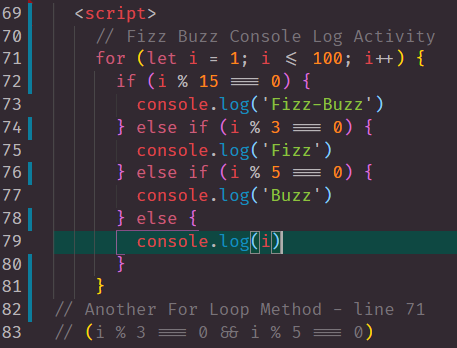

# javaScript102

## This blog post was about understanding JavaScript
> How we did this was by going over these main concepts

```
    - Arrays & Console Logging
    - Conditional Logic
    - Statement structure
    - If / Else If & Switch Case
    - For Loops
    - Fizz Buzz Example

```

## Array Page 

## Loops and More Page

## Favorite Game Page

***This is what the end result should look like***




## LINKS

- [javaScript102 Link] Coming Soon!
- [Github Repo Link](https://github.com/nicholasd-uci/javaScript102)

- - -
© 2020 NPRD, Nicholas Paul Ruiz Dallas