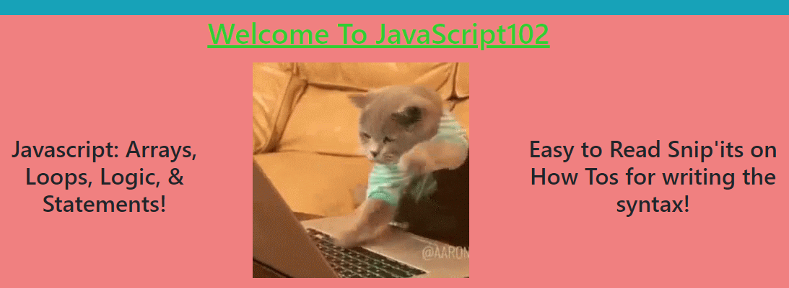
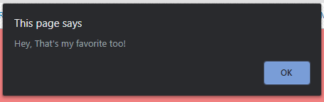
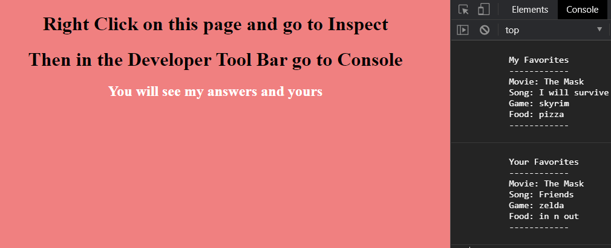

# javaScript102
## CLASS MOTO : JS... SO EASY... EVEN A CAT COULD DO IT!


## This blog post was about understanding JavaScript
> How we did this was by going over these main concepts

```
    - Arrays & Console Logging
    - Conditional Logic
    - Statement structure
    - If / Else If & Switch Case
    - For Loops
    - Fizz Buzz Example

```

## Array Page 
> In this section we went over import feature to know about console logging in the browser

***Example of the page***


## Loops and More Page
> In this section we went over import feature to know about For Loops and gives a console log example

***Example of the page***


## Favorite Game Page
> In this section you play a game were I ask you about your favorite things and we see if they match with my favorite things. 

> If our interest are the same this message will pop up




***This is what the end result should look like***




## LINKS

- [javaScript102 Link] Coming Soon!
- [Github Repo Link](https://github.com/nicholasd-uci/javaScript102)
- [Nicholas Dallas GitHub](https://github.com/nicholasd-uci)

- - -
© 2020 NPRD, Nicholas Paul Ruiz Dallas

